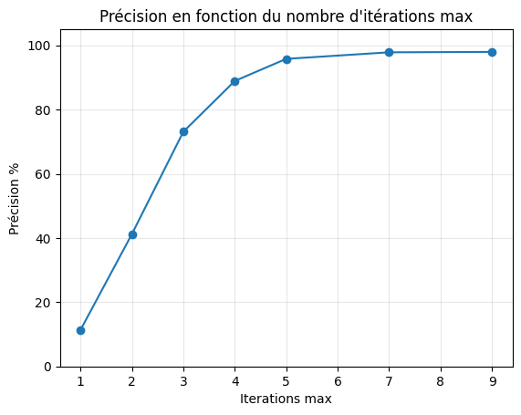

# Attaques adversariales sur les systèmes de détection de Deepfakes

## Auteurs

- Antoine Montier
- Cindy Hartmann

## Motivation et buts 

L’**intelligence  artificielle**  s’est  imposée  comme  approche  privilégiée  pour  la 
conception  de  **systèmes  de  détection  de  Deepfake**.  Néanmoins, ceux-ci ne sont pas 
infaillibles et il existe diverses manières de les **contourner**.  
 
Notre  projet  s’inscrit  dans  ce  contexte,  et  se concentre justement sur l’étude 
des **attaques adversariales** appliquées aux systèmes de détection de **face swapping**, 
une  technique  de  **Deepfake**  consistant  à  apposer  le  visage  d’une  personne  sur  une 
autre. 
 
Nos objectifs étaient les suivants :  

-  **Comprendre** le fonctionnement des attaques adversariales; 
-  **Appliquer** ces attaques à un **modèle de détection** de Deepfakes / face swapping existant;
-  **Mesurer** la dégradation des **performances** du détecteur. 

Pour les atteindre, nous avons dans un premier temps effectué un **état de l’art** 
des attaques adversariales. Puis, nous avons choisi un **modèle** et un **jeu de données** de 
référence. Enfin, nous avons appliqué certaines de ces attaques sur notre modèle et 
constaté la dégradation de ses **performances**. 

## Documents

### État de l'art

Nous avons commencé par réaliser un état de l'art sur différentes attaques appliquées sur le dataset du MNIST. Le but était de sélectionner les attaques qui allaient nous intéresser pour la suite.

- [État de l'art](./etat-de-l-art/Attaques-adversariales_etat-de-l-art_Antoine-Montier_Cindy-Hartmann.pdf)
- [Annexes pour l'état de l'art](./etat-de-l-art/annexes/)

### Préprocessing de visage et manipulation de modèle

Nous avons découpé et recadré les différentes images utilisées lors de ce projet de manière à avoir des données d'entraînnement bien calibrées pour le système de détection.

- [Notebook montrant la manière dont l'outil de *freearhey* extrait les visages](./preprocessing/extract_faces.ipynb)
- [Script de conversion vers un modèle au format `onnx`](./model-conversion/convert_to_onnx.py)

### Évaluation du modèle

Pour attaquer notre système de détection, il a d'abord fallu s'assurer qu'il fonctionne bien. Nous avons donc amélioré le préprocessing effectué sur les données de manière à rendre le modèle plus performant. 

- [Évaluation du modèle sur l'**ancien** jeu de données](./eval_model/eval-model_old-dataset.ipynb)
- [Évaluation du modèle sur le **nouveau** jeu de données (obtenu après filtrage)](./eval_model/eval-model_new-dataset.ipynb)

### Attaques

Le code des différentes attaques

- [*PGD*](./attacks-on-Deepfakes/pgd.ipynb)
- [*DeepFool*](./attacks-on-Deepfakes/deepfool.ipynb)
- [Évaluation d'UAPs appliquées à **PGD**](./attacks-on-Deepfakes/uap-pgd-eval.ipynb)
- [Évaluation d'UAPs appliquées à **DeepFool**](./attacks-on-Deepfakes/uap-df-eval.ipynb)

Ce code a également permis d'obtenir des graphique comme celui présenté ci-dessous :

### UAPs

Les **_UAP_** sont des perturbations universelles, elles ouvrent la voie vers des attaques sur des modèles **blackbox**.

Nous en avons **généré** avec *PGD* et *DeepFool* :

- [UAP avec **PGD**](./UAP/UAP-gen/uapgd.py)
- [UAP avec **DeepFool**](./UAP/UAP-gen/uapdeepfool.py)

Puis nous avons **évalué** la performance des perturbations :

- [Évaluation d'une perturbation universelle générée avec **PGD**](./UAP/UAP-gen/uap-pgd-eval.ipynb)
- [Évaluation d'une perturbation universelle générée avec **DeepFool**](./UAP/UAP-gen/uap-df-eval.ipynb)

Les différentes perturbations universelles obtenues lors de ce projet sont stockées dans [*ce dossier*](./UAP/UAPs/). Leur nom de fichier précise les **paramètres** utilisés pour leur génération.

Finalement, nous avons généré des **Deepfakes** de célébrités disponibles dans [*ce dossier*](./UAP/UAP-transfert/imgs/). Nous avons ensuite appliqué la perturbation sur ces images en utilisant [*ce notebook*](./UAP/UAP-transfert/uap-celebrities.ipynb) avant d'utiliser un détecteur de Deepfake en ligne dans le but d'observer si les images sont reconnues comme étant des Deepfake. Les **scores** sont [*disponibles ici*](./UAP/UAP-transfert/scores.md)
