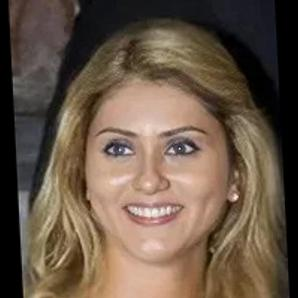
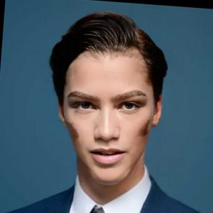
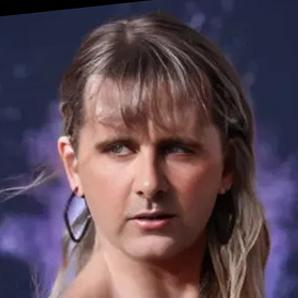
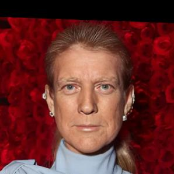
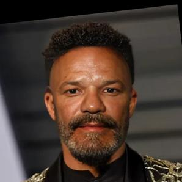

# Scores of the UAP on the special dataset (celeb1..11)

|  Original \ DeepFake probability  | no modification| UAP-PGD applied (`uap-pgd_delta=0.04_eps=0.05_max-iter=60.npy`) | UAP-DeepFool applied (`uap-df_delta=0.03_overshoot=0.05.npy`) |
|---------|----------------|-----------------------------------------------------|---------------------------------------------------|
|   | 99%            | 1%                                                  | 99%                                               |
|   | 99%            | 52%                                                 | 77%                                               |
|   | 99%            | 2%                                                  | 99%                                               |
|   | 85%            | 1%                                                  | 99%                                               |
|   | 99%            | 1%                                                  | 99%                                               |
|   | 99%            | 98%                                                 | 99%                                               |
|   | 94%            | 1%                                                  | 99%                                               |
|   | 94%            | 2%                                                  | 99%                                               |
|   | 99%            | 2%                                                  | 99%                                               |
|   | 99%            | 1%                                                  | 99%                                               |
|  | 99%            | 77%                                                 | 99%                                               |